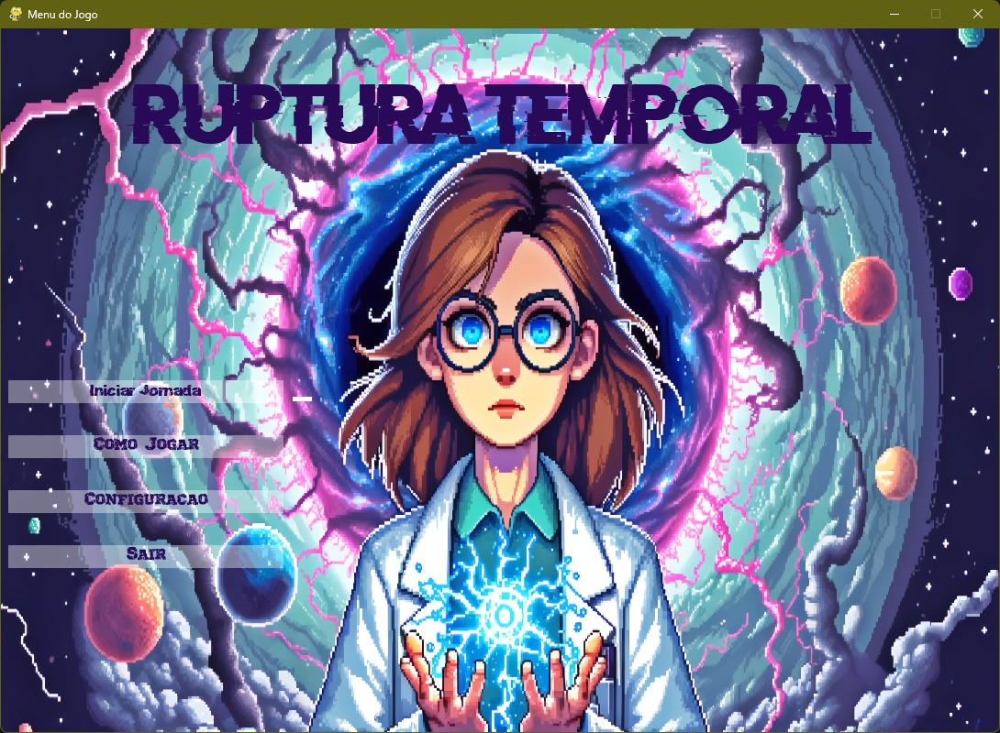
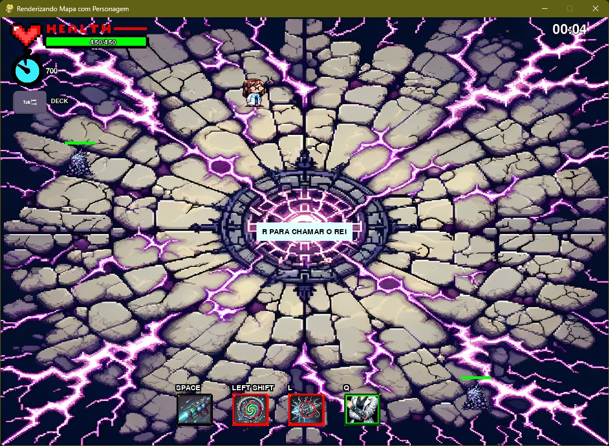
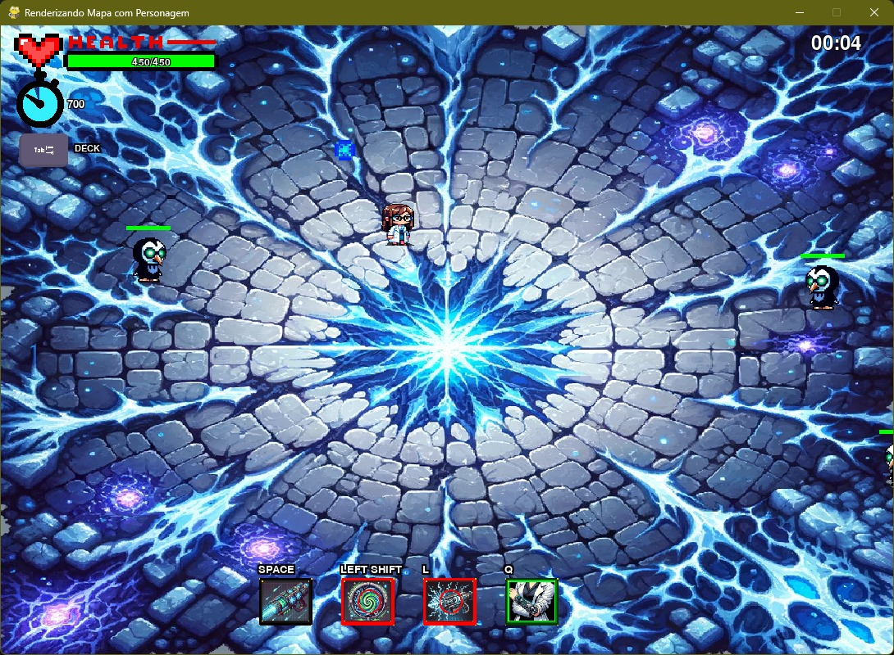
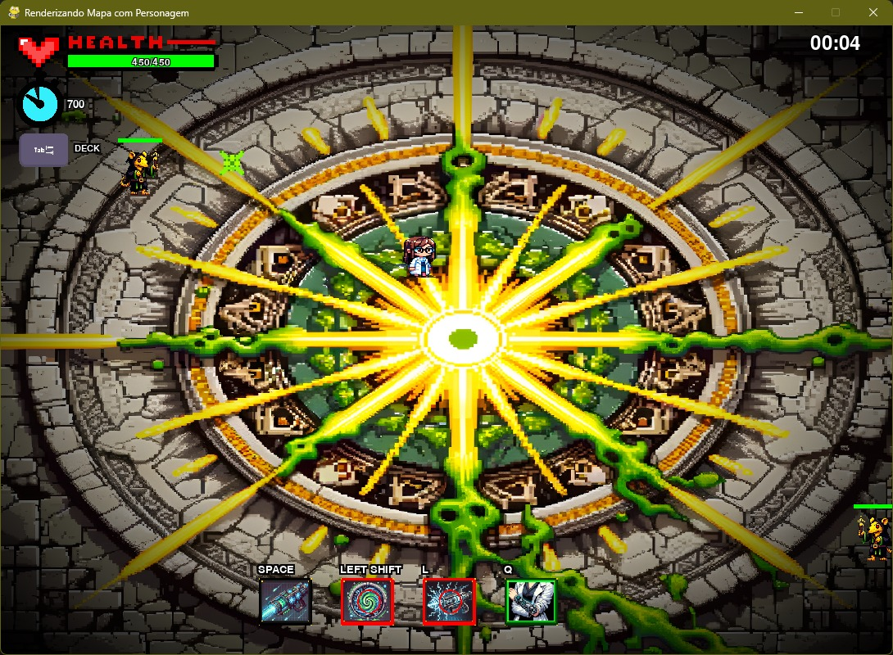
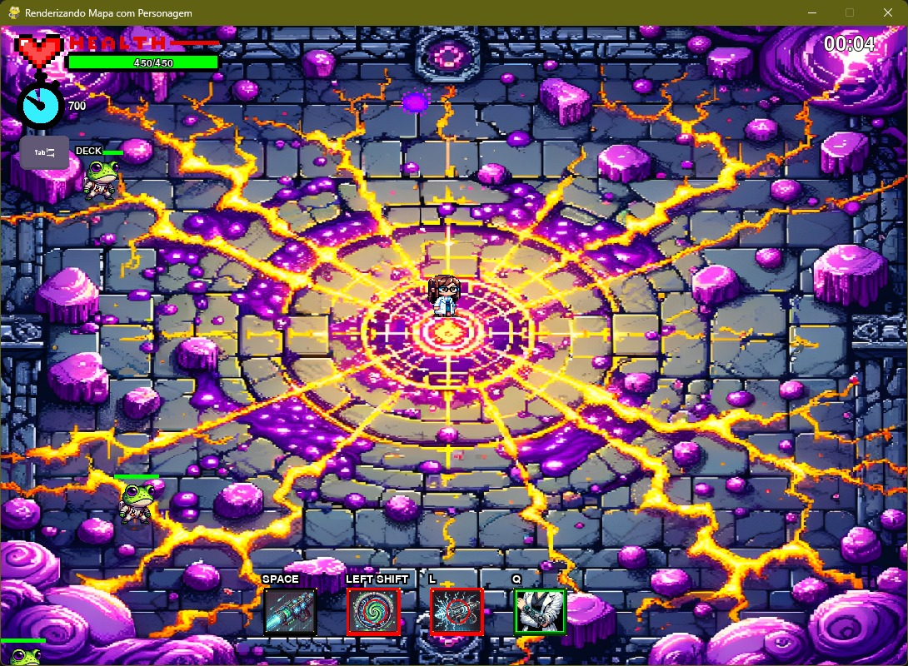
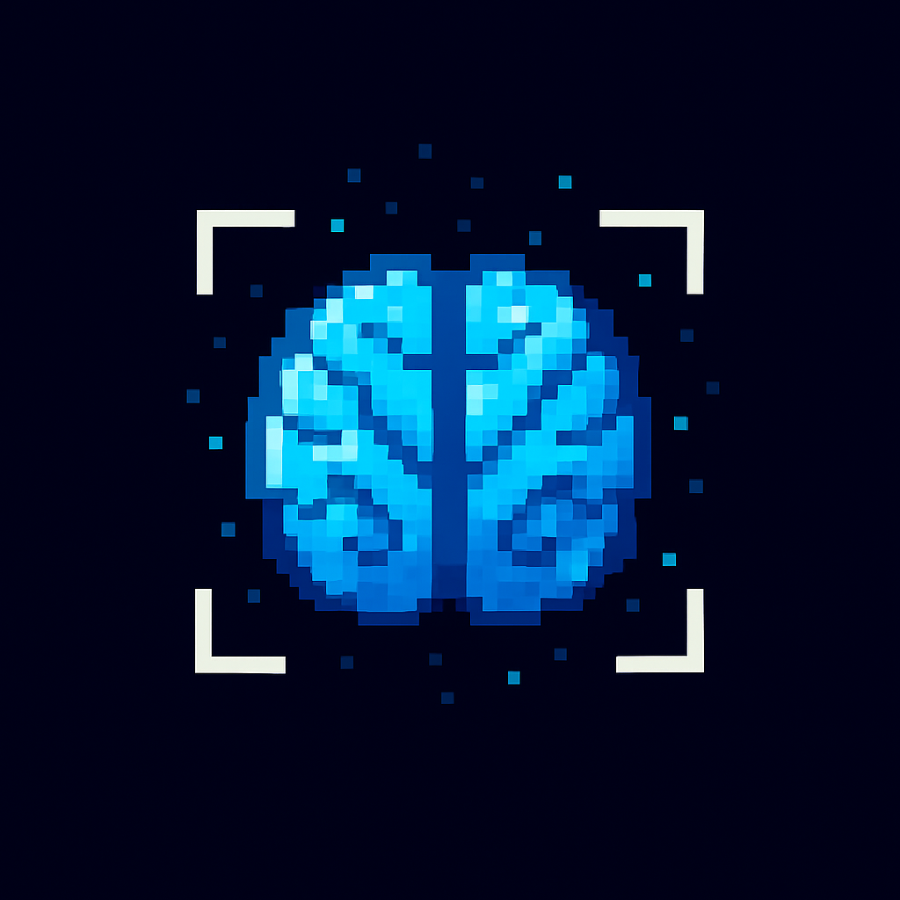
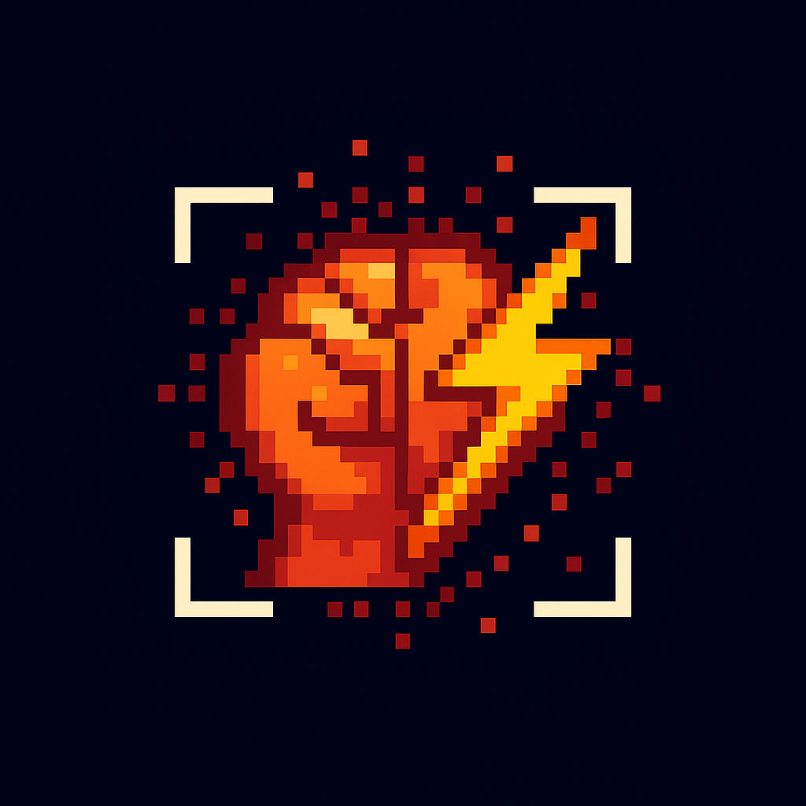
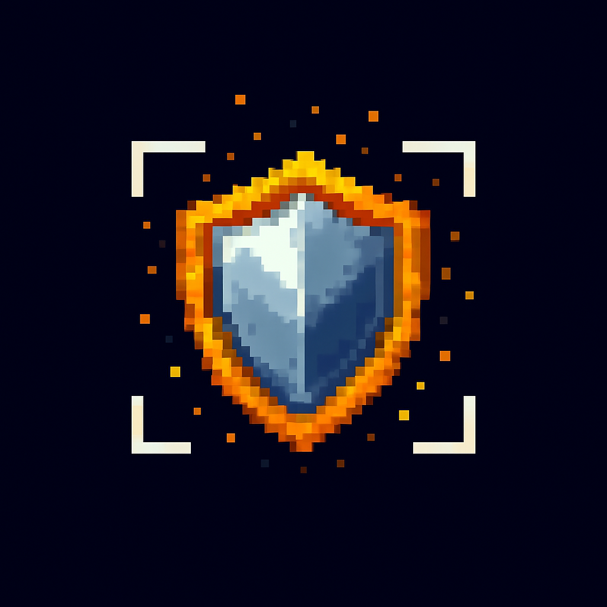
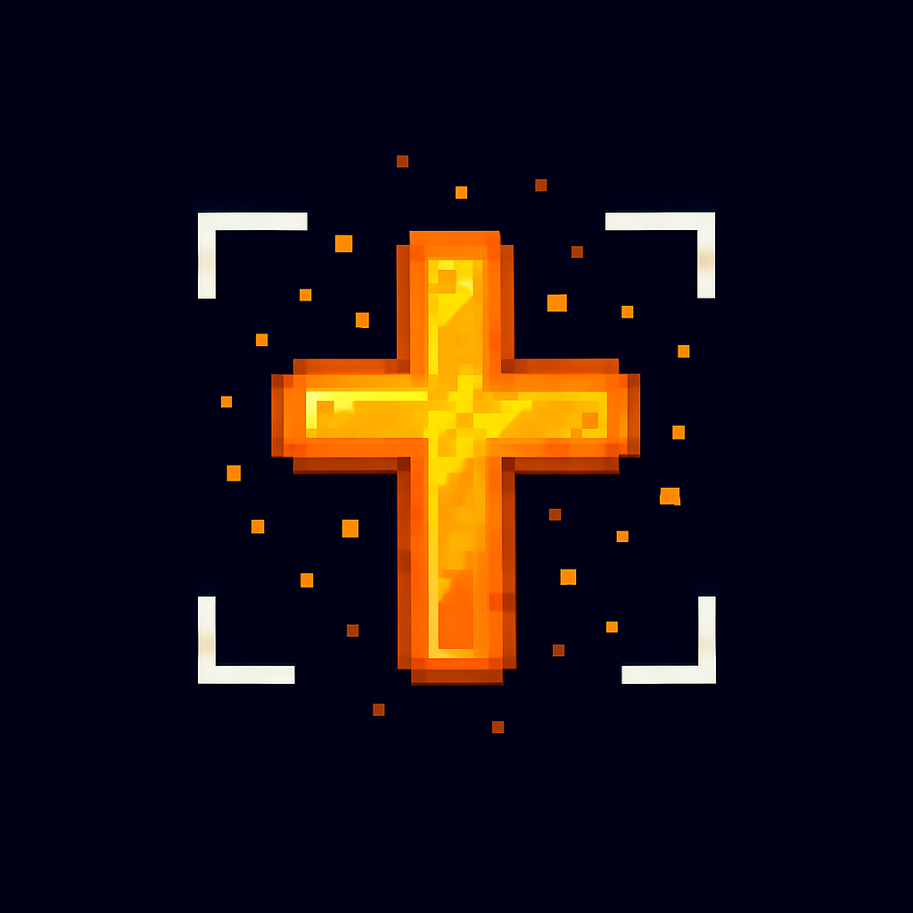
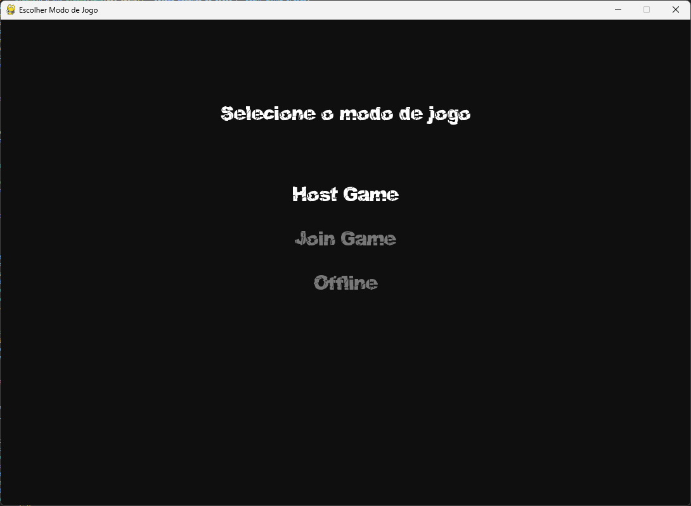

    Ruptura Temporal – Beta

  Um jogo open-source desenvolvido em Python com Pygame
  Agora com modo LAN integrado: jogue sozinho (offline) ou com um amigo na mesma rede local.

    Sobre o Projeto

"Ruptura Temporal" é um jogo desenvolvido em Python usando a biblioteca Pygame. Este projeto foi construído não apenas como um jogo, mas como um aprendizado pessoal e comunitário. Minha jornada nesse projeto começou com a ideia de criar algo especial para a minha namorada, mas acabou se tornando algo maior do que eu poderia imaginar. Agora, o jogo está disponível para a comunidade open-source com o objetivo de contribuir para o aprendizado e diversão de todos.

Neste projeto cada linha, cada fase e cada elemento foram criados como parte do meu aprendizado. É uma colcha de retalho — remendada e improvisada, mas que tem seu propósito e sentido únicos.

Evolução do Projeto

Com o avanço do desenvolvimento, o "Ruptura Temporal" passou por uma grande atualização:  
agora, o mesmo repositório inclui **dois modos de jogo** totalmente integrados — o clássico **modo offline** e o novo **modo LAN (multiplayer local)**.

O modo LAN foi desenvolvido como parte prática da disciplina **Redes de Computadores e Comunicação de Dados** (UnB), demonstrando a aplicação de **sockets TCP** para permitir partidas sincronizadas entre dois jogadores em tempo real.

O sistema foi estruturado de forma modular, mantendo a base do jogo original e integrando a comunicação em rede diretamente à lógica principal.

COMO INSTALAR O JOGO SEM OS ARQUIVOS .py (PARA QUEM NÂO É DEV):
[CLIQUE AQUI](https://github.com/HenryMelo23/Ruptura_Temporal/releases/tag/v0.0.1)

MENU :

  

🌊 Fase 1: A Praia em Ruínas

  

❄️ Fase 2: O Reino Gélido

  

🐀 Fase 3: A Dimensão dos Ratos Cultistas

  

🐸 Fase 4: O Mundo dos Sapos Cientistas

  

🔥 Fase 5: Em Desenvolvimento

A quinta e última fase ainda está em desenvolvimento. Esta será a fase final, onde o jogador enfrentará o boss derradeiro. No entanto, para garantir que a experiência seja equilibrada e divertida, lançamos o jogo antes de concluir esta fase para receber feedback da comunidade.

Temos percebido que muitos jogadores encontram dificuldades nas fases iniciais, especialmente na segunda fase. Por isso, antes de avançar para a conclusão do jogo, estamos focando em ajustes de dificuldade e balanceamento para melhorar a experiência geral.

    Áureas — As Passivas dos Personagens

Cada jogador, ao iniciar uma partida, pode escolher uma Áurea, que define a passiva (habilidade automática) do personagem durante o jogo.
As Áureas influenciam diretamente o estilo de jogo e os bônus obtidos em combate.

Essa escolha pode ser feita antes do início da fase, tanto no modo Offline quanto no modo LAN.

    Áurea Racional
  

    
  

  "A paciência é a arma mais poderosa."

  Ideal para jogadores estratégicos e pacientes.
  - Aumenta a pontuação quando o jogador permanece imóvel por alguns segundos.
  - Após 5 segundos parado, o jogador ganha +3 pontos, aumentando conforme o nível da Áurea.
  - Um pequeno efeito visual verde aparece próximo ao personagem indicando o ganho.

  Áurea Impulsiva
  

    
  

  "A fúria é o combustível da vitória."

  Indicada para jogadores que preferem um estilo agressivo e dinâmico.
  - Concede um buff temporário após 5 eliminações consecutivas sem receber dano.
  - O bônus pode ser aumento de dano ou velocidade, escolhido aleatoriamente.
  - Caso o jogador sofra dano, o contador de eliminações é reiniciado.

  Áurea Vanguarda
  

    
  

  "A dor também é uma arma."

  - Quando o jogador sofre dano direto de um inimigo, ele incendeia os inimigos próximos, causando dano contínuo.
  - Cria uma zona perigosa para inimigos corpo a corpo.
  - Boa para quem joga na linha de frente e gosta de confrontos diretos.

  Áurea Devota
  

    
  

  "Fé é escudo."

  Ideal para jogadores que valorizam resistência e defesa.

  - Concede um escudo temporário que absorve o próximo golpe recebido.
  - O escudo se regenera automaticamente após um intervalo fixo.
  - Permite resistir a ataques consecutivos sem perder vida imediatamente.

  

> Agora é possível criar uma sessão (Host Game) ou conectar-se a uma partida existente (Join Game) diretamente pelo menu inicial.

    Tecnologias
Python — Linguagem principal.

Pygame — Framework usado para o desenvolvimento do jogo.

Imagens geradas por IA — Criadas com inteligência artificial e tratadas manualmente por mim.

    Comunicação em Rede

A versão Beta introduz uma camada de rede baseada em **sockets TCP** e **serialização JSON**, permitindo comunicação direta entre duas instâncias do jogo.  
A arquitetura segue o modelo **cliente-servidor**, onde o Host é responsável por manter o estado do jogo e enviar atualizações para o cliente em tempo real.

**Principais características:**
- Sincronização de posições, ações e inimigos;
- Controle de latência e integridade de pacotes;
- Threads independentes para envio e recebimento;
- Escolha de modo (Host / Join / Offline) integrada ao menu principal.

    Objetivo
O projeto tem o propósito de:

Implementar comunicação em rede: integrar conceitos de redes de computadores a um ambiente de jogo, aplicando sockets TCP e lógica de sincronização de estado em tempo real.

Compartilhar conhecimento: Tornar o código aberto e acessível para que qualquer pessoa possa aprender junto comigo.

Criar algo único e pessoal: Transformar a ideia inicial em algo que todos possam aproveitar e modificar.

Contribuir para a comunidade: Oferecer diversão e aprendizado para quem quiser entrar no mundo do desenvolvimento de jogos.

Como Contribuir

Caso deseje contribuir com o projeto "Ruptura Temporal", sinta-se livre para:

- Fazer fork e criar pull requests.
- Relatar bugs e sugerir melhorias.
- Envie sugestões de otimização de sincronização entre cliente e servidor.

Se desejar contribuir com melhorias na camada de rede:
- Teste o modo LAN em diferentes máquinas e redes locais;
- Relate comportamentos de latência, desconexão ou descompasso de estado;
- Compartilhar ideias e aprender junto!

    Licença

Este projeto está licenciado sob a Creative Commons Attribution-NonCommercial-ShareAlike 4.0.

Direitos e Restrições:

Uso Comercial Proibido: Não é permitido usar o projeto para fins comerciais sem autorização explícita.

Modificação e Redistribuição: Permite modificar e redistribuir o projeto, desde que atribua ao autor original e mantenha a mesma licença Creative Commons.

Agradecimentos

Gostaria de agradecer a todos que acompanharam e apoiaram o desenvolvimento desse projeto. A ideia inicial era algo pessoal, mas graças ao apoio da comunidade, o projeto cresceu e se tornou algo maior. Espero que este projeto ajude a inspirar e ensinar aqueles que querem aprender a criar jogos e explorar o desenvolvimento em Python com o Pygame, Também agradeço à Universidade de Brasília e à disciplina de **Redes de Computadores e Comunicação de Dados**,  
que possibilitaram a expansão do projeto para um ambiente multiplayer e a consolidação desta versão Beta.

Links e Contatos

- **Instagram:** [@henri_meelo](https://www.instagram.com/henri_meelo/)
  
- **YouTube:** [HMeloI](https://www.youtube.com/@HMeloI)

Seja você um desenvolvedor iniciante ou experiente, "Ruptura Temporal" é um projeto feito para todos. Aproveite, aprenda e contribua. Vamos crescer e evoluir juntos!

Versão Atual: Ruptura Temporal – Beta (Offline + LAN)

